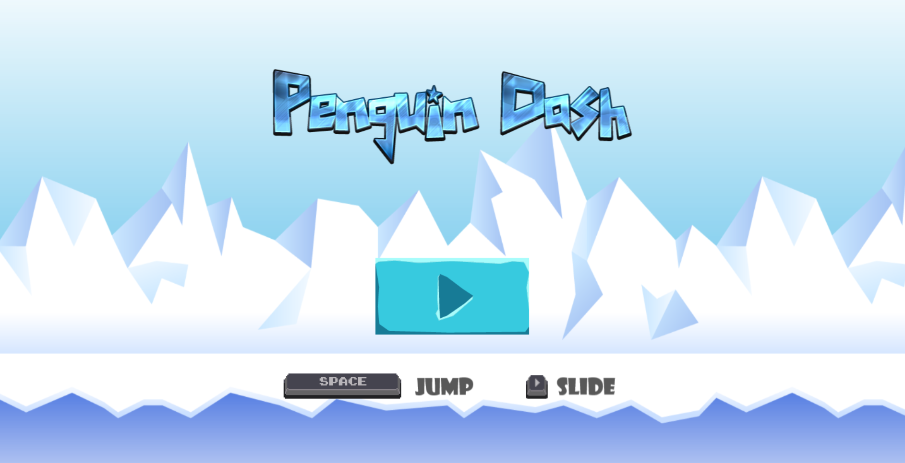

# ⛄ Penguin Dash: Frosty Adventure

**Slide, jump, and glide through a frosty adventure!**

## 📖 Description

Penguin Dash is an exciting 2D platformer runner game set in a world of snowy mountains. Dodge snowman enemies, collect power-ups, and experience an icy adventure like never before!

## 📷 Demo Gameplay


## 🎮 Play Game

> Click the image to play the game in your browser

[](https://indiecodermm.github.io/penguin-dash/)

## 🔧 Built With

- [Phaser.js](https://phaser.io/)
- TypeScript
- Parcel

## 🕹 Controls

- **SPACE**: Jump
- **Right Arrow**: Slide

## 🎨 Assets

- Sprites and background images from [GAMEARTGUPPY](https://www.gameartguppy.com/)
- Sound Effect from [Pixabay](https://pixabay.com/?utm_source=link-attribution&utm_medium=referral&utm_campaign=music&utm_content=6462)

## 🚀 Getting Started

To run **Penguin Dash** locally, follow these steps:

1. Make sure you have [Node.js](https://nodejs.org/) installed on your system.
2. Clone or download this repository to your machine.
3. Navigate to the project directory and open a terminal.
4. Install *Parcel* globally by running:
```sh
npm install -g parcel-bundler
```
5. Install the project dependencies with:
```sh
npm install
```
6. To start the development server, use:
```sh
npm start
```
*Parcel will automatically compile and refresh the game as you make changes to the code.*

## 🎈 Deployment 

To deploy your game, follow these steps:

1. Build the project using:
```sh
npm run build
```
2. Customize the repository configs in `package.json`
3. Deploy the game directly to GitHub Pages with:
```sh
npm run deploy
```

## 🙏 Acknowledgment

This game was built by following the tutorial project from the book [Infinite Runner in Phaser 3](https://ourcade.co/books/infinite-runner-phaser3/).

## 📧 Contact

If you have any ideas, or comments regarding the game, please don't hesitate to reach out to me. I'd love to hear from you!

- Email: hthant00chk@gmail.com
- LinkedIn: [hthantoo](https://www.linkedin.com/in/hthantoo)

## 🤝 Contribution

I'd love your help in making this game even better! If you find any bugs 🐞 or have ideas 💡 for new features, let me know by [opening an issue](https://github.com/IndieCoderMM/penguin-dash/issues).

## 📜 License

This project is licensed under the [MIT License](./LICENSE).
